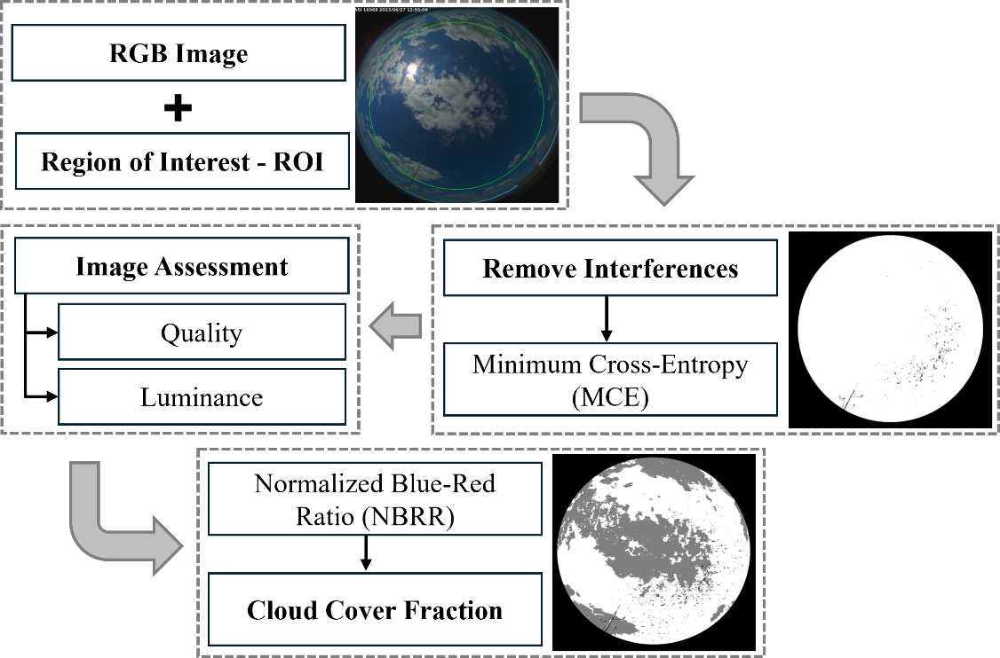

# Estimativa de CF em ASI

O algoritmo desenvolvido para estimar a fração de cobertura de nuvens (CF) em imagens "All Sky" (ASI) segue uma série de etapas descritas ao longo desse tópico. O primeiro passo consiste na definição de uma região de interesse (ROI) e a aplicação de uma máscara binária para eliminar interferências visuais, como suportes de câmeras e objetos estranhos, utilizando a técnica de Minimum Cross-Entropy (MCE) para determinar um limiar ótimo de segmentação. Também é feita correção de distorções cromáticas associadas a condições de baixa iluminação. Após cálculo do índice espectral NBRR (Normalized Blue-Red Ratio) para cada pixel da imagem, a segmentação das regiões de céu claro e nuvens é realizada por meio da limiarização adaptativa, que ajusta a segmentação com base em características locais da imagem, permitindo lidar com variações de iluminação e contraste. Com a segmentação, os pixels são classificados em céu claro, nuvem e interferência, e a fração de cobertura de nuvens é calculada com base na proporção de pixels classificados como nuvem em relação aos pixels de céu claro.

Foi desenvolvido um algoritmo específico para a estimativa da fração de cobertura de nuvens (Cloud Fraction – CF) a partir de imagens hemisféricas obtidas por câmeras que geram All Sky Images (ASIs). O processamento de cada imagem envolve uma sequência estruturada de etapas, que incluem a definição da região de interesse, a aplicação de máscaras para remoção de interferências, a avaliação da qualidade da imagem, a análise da luminosidade com correção de temperatura da imagem, o cálculo do índice NBRR (Normalized Blue-Red Ratio), e, por fim, a estimativa da CF com base na proporção de pixels classificados como nuvem ou céu claro. Cada uma dessas etapas é detalhada a seguir.

A região de interesse (Region of Interest – ROI) é definida como um círculo centrado na imagem, com raio proporcional às suas dimensões. Para limitar a análise ao campo de visão correspondente a um ângulo zenital de até 80°, o raio é reduzido em 15%. Em casos de desalinhamento ou distorções na imagem, a detecção automática da ROI pode ser realizada por meio do algoritmo HoughCircles, que utiliza filtros de borda e parâmetros de restrição para identificar, dentre os possíveis círculos, aquele que melhor representa a área útil da imagem.

Para eliminar interferências visuais presentes nas imagens, como suportes da câmera, hastes sombreadoras, insetos e pessoas, foi aplicada uma máscara binária obtida por limiarização. A segmentação foi realizada utilizando a técnica de Minimum Cross-Entropy (MCE), proposta por Li & Lee (1993) e aprimorada por Li & Tam (1998), a qual permite determinar automaticamente o limiar ótimo para separar regiões de interesse da imagem ao minimizar a entropia cruzada entre a imagem original e sua versão segmentada, sem pressupostos prévios sobre a distribuição das intensidades. Essa abordagem de limiarização global (ou seja, com um único limiar aplicado a toda a imagem) foi implementada por meio do método threshold_li, disponível na biblioteca scikit-image.

Como etapa de controle de qualidade, foi implementado um critério baseado na proporção entre pixels válidos e aqueles previamente marcados como interferência. Valores fora de um intervalo aceitável, determinado empiricamente a partir de um conjunto de imagens de referência, são indicativos de possíveis problemas na imagem. Esses casos geralmente refletem duas situações: (1) presença excessiva de elementos obstrutivos, como suportes ou objetos próximos à câmera, que inviabilizam a análise adequada do céu, ou (2) ocorrência de reflexos intensos em componentes da estrutura da câmera, os quais podem ser erroneamente classificados como céu claro. Imagens que não atendem a esse critério são descartadas ou sinalizadas para revisão manual, mas todas as imagens analisadas foram aprovadas para análise.

Com o objetivo de corrigir distorções cromáticas associadas a condições de baixa iluminação, foi implementado um procedimento de ajuste da temperatura de cor nas imagens ASI. A temperatura de cor é uma medida que descreve a tonalidade da luz emitida por uma fonte, sendo expressa em kelvins (K); temperaturas mais baixas tendem ao vermelho/amarelo, enquanto temperaturas mais altas resultam em tons mais azulados. Para identificar possíveis distorções, a imagem é convertida para o espaço de cor CIELAB (ou simplesmente LAB), no qual a componente L representa a luminância, enquanto a e b codificam a informação de cor em eixos verde–vermelho e azul–amarelo, respectivamente. Rashid et al. (2021) destacam que, sob baixa irradiância (<100 W/m²), há perda de informação no canal azul, o que pode comprometer a segmentação de nuvens. Assim, verifica-se a proporção de pixels amarelados na imagem (uma característica comum quando o Sol está próximo ao horizonte) por meio da identificação de pixels cujo valor no canal b excede um limiar associado ao amarelo. Caso a porcentagem de pixels amarelados ultrapasse 10% do total, aplica-se uma correção cromática com uma constante de temperatura negativa (−40), que desloca o canal b em direção ao azul, reduzindo a dominante amarelada. Por fim, os valores da imagem são limitados ao intervalo [0, 255] e convertida de volta para o espaço RGB.

As imagens capturadas pela câmera do tipo "All Sky" são inicialmente representadas no espaço de cores RGB, onde cada pixel é composto por três canais correspondentes às componentes vermelha (Red), verde (Green) e azul (Blue). A partir desses canais, calcula-se o índice espectral NBRR (Normalized Blue-Red Ratio), definido como:

NBRR = (B - R)/(B + R)

em que B e R representam, respectivamente, os valores dos canais azul e vermelho. Esse índice explora o contraste espectral entre céu claro (geralmente mais azul) e nuvens (mais próximas do branco, com menor diferença entre B e R), permitindo uma segmentação eficaz.

A segmentação das regiões de céu claro e nuvens foi realizada a partir da imagem NBRR convertida para escala de cinza, utilizando o método de limiarização adaptativa adaptiveThreshold, da biblioteca OpenCV. Essa técnica calcula limiares locais com base na média dos valores de pixels em regiões definidas por uma janela deslizante (block size), ajustada por uma constante. O tamanho do bloco define a vizinhança usada para o cálculo local e influencia diretamente a sensibilidade espacial da segmentação: blocos menores capturam melhor as variações locais, mas são mais suscetíveis a ruído; blocos maiores promovem suavização, podendo ocultar pequenos elementos como nuvens fragmentadas. A constante atua como fator de correção nos limiares locais, modulando a sensibilidade do método a flutuações de intensidade: valores maiores tornam o limiar mais conservador, reduzindo a detecção de nuvens tênues. A calibração desses parâmetros foi realizada empiricamente com base em testes de sensibilidade, resultando na adoção de block_size igual a 651 e constant igual a 10.0, valores que proporcionaram bom equilíbrio entre robustez e capacidade de detecção de nuvens sob diferentes condições de iluminação.

A segmentação resultante classifica os pixels da imagem em três categorias distintas: céu claro (valores altos), nuvem (valores intermediários) e interferências (valores baixos), mapeados respectivamente para branco (255), cinza (127) e preto (0), após a aplicação da máscara que elimina regiões com ruídos visuais. A figura 1 apresenta o exemplo da análise de uma ASI, com marcação da ROI, máscara de interferências e imagem final segmentada. Essa técnica adaptativa, baseada em limiares locais, permite lidar com variações de iluminação e contraste que ocorrem em diferentes áreas da imagem. A partir da imagem segmentada, é contabilizada a quantidade de pixels classificados em cada categoria para estimar a porcentagem de cobertura de nuvens em relação à área útil da imagem (excluindo as interferências). O resultado final é um valor inteiro que representa a fração percentual de nuvens observadas na imagem do céu.

*Figura 1 - Exemplo da análise de uma ASI, com marcação da ROI, máscara de interferências e imagem final segmentada.*

*Figura 2. Fluxograma da fração de cobertura de nuvens estimada usando imagens obtidas pelo All Sky Image (ASI).*

Referências

C.H. Li, C.K. Lee, Minimum cross entropy thresholding, Pattern Recognition, Volume 26, Issue 4, 1993, Pages 617-625, ISSN 0031-3203, https://doi.org/10.1016/0031-3203(93)90115-D.

C.H. Li, P.K.S. Tam, An iterative algorithm for minimum cross entropy thresholding, Pattern Recognition Letters, Volume 19, Issue 8, 1998, Pages 771-776, ISSN 0167-8655, https://doi.org/10.1016/S0167-8655(98)00057-9.

Muhammad Syazwan Rifdi Bin Mohd Rashid, Jinghong Zheng, Ernest Sng, Kurinji Malar Rajendhiran, Zhen Ye, Li Hong Idris Lim, An enhanced cloud segmentation algorithm for accurate irradiance forecasting, Solar Energy, Volume 221, 2021, Pages 218-231, ISSN 0038-092X, https://doi.org/10.1016/j.solener.2021.03.061.