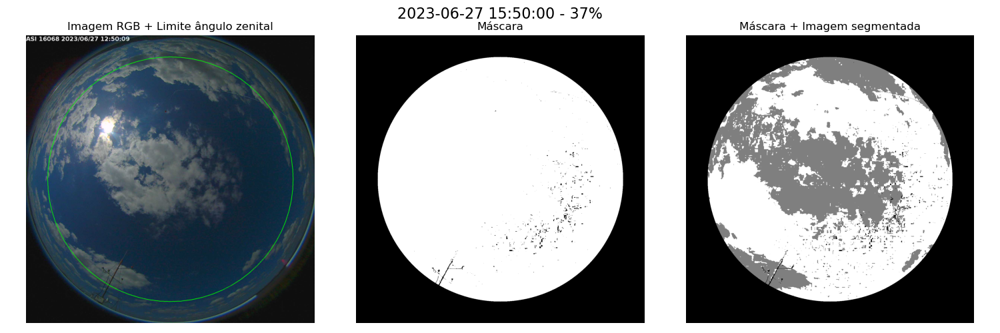
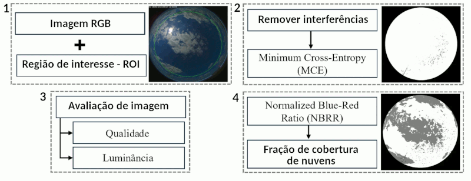

# Estimativa de CF em ASI

*Figura 1 - Exemplo da análise de uma ASI, com marcação da ROI, máscara de interferências e imagem final segmentada.*

Uma All Sky Image (ASI) é uma imagem completa de céu obtida por uma câmera hemisférica, permitindo análises detalhadas da cobertura de nuvens e das condições de iluminação. A Figura 1 apresenta um exemplo dessa análise, destacando a região de interesse (ROI), a aplicação da máscara para remoção de interferências visuais e a imagem final segmentada em nuvem e não-nuvem. O algoritmo para estimar a fração de cobertura de nuvens a partir de ASIs é apresentado na Figura 2.

*Figura 2. Fluxograma da fração de cobertura de nuvens estimada usando imagens obtidas pelo All Sky Image (ASI). Adaptado de Carvalho et al. (2025)*

O primeiro passo consiste em definir a região de interesse (ROI) como um círculo centralizado na imagem, com raio proporcional às suas dimensões. Esse raio é reduzido em 15% para limitar a análise ao campo de visão correspondente a ângulos zenitais de até 80°. Para eliminar interferências visuais — como suportes da câmera, hastes sombreadoras ou insetos — aplica-se uma máscara binária obtida por limiarização. A segmentação é realizada utilizando a técnica de Minimum Cross-Entropy (MCE), proposta por Li e Lee (1993) e posteriormente aprimorada por Li e Tam (1998).

Como etapa de controle de qualidade, foi adotado um critério para descartar imagens com excesso de interferências, baseado na proporção entre pixels válidos e aqueles previamente marcados como obstruções. Todas as imagens analisadas atenderam a esse critério e foram aprovadas para processamento. Além disso, foi implementado um ajuste de temperatura de cor (análise de luminância) para corrigir distorções cromáticas associadas a condições de baixa iluminação. Temperaturas mais baixas tendem a gerar tonalidades avermelhadas ou amareladas, enquanto temperaturas mais altas resultam em tons azulados. Rashid et al. (2021) destacam que, sob baixa irradiância (<100 W/m²), ocorre perda de informação no canal azul, o que pode comprometer a segmentação das nuvens.

As imagens ASI são inicialmente representadas no espaço de cor RGB, em que cada pixel é composto pelos canais vermelho (R), verde (G) e azul (B). A partir desses valores, calcula-se o índice espectral Normalized Blue-Red Ratio (NBRR), definido como:

$$
NBRR = \frac{B - R}{B + R}
$$

Esse índice explora o contraste espectral entre céu claro (tipicamente mais azulado) e nuvens (mais próximas do branco, com menor diferença entre azul e vermelho), permitindo uma segmentação eficiente. A imagem segmentada final classifica os pixels em três categorias: céu claro (valores altos), nuvem (valores intermediários) e interferência (valores baixos), representados respectivamente por branco (255), cinza (127) e preto (0). Por fim, a fração de cobertura de nuvens é estimada pela razão entre o número total de pixels classificados como nuvem e a área útil da imagem, desconsiderando os pixels afetados por interferências.

Para mais informações, consulte o texto [Algoritmo de Detecção de Nuvens em Imagens All Sky](https://www.monolitonimbus.com.br/algoritmo-de-deteccao-de-nuvens-em-imagens-all-sky/). Esse método foi também utilizado no artigo [Lake-Breeze Influence on Cloudiness Over a Brazilian Reservoir: A Potential Hotspot for Floating Photovoltaic Energy](https://doi.org/10.1007/s41748-025-00908-4).

## EM DESENVOLVIMENTO

O histograma da imagem (nesse caso em tons de cinza) representa a distribuição de intensidades de pixels. Ao normalizar (probabilidades), vira uma distribuição de probabilidade. A entropia mede o grau de desordem/variedade dessa distribuição:

- Entropia baixa: a maioria dos pixels tem valores parecidos (imagem homogênea → céu limpo ou todo nublado).
- Entropia alta: os pixels estão espalhados por várias intensidades (imagem heterogênea → mistura de nuvens e céu).

Para o cálculo de HTW (Histogram Tail Width), deve-se acumular as probabilidades (cumsum). Depois, o script acha em que intensidade o histograma acumula 25% e 75% da área. O HTW = x₇₅ – x₂₅ é a largura da parte “central” do histograma.

- HTW pequeno: histograma concentrado → imagem homogênea.
- HTW grande: histograma espalhado → imagem heterogênea.

Deve-se encontrar um limiar fixo de Entropia e de HTW da imagem para defenir imagens que sejam homogêneas ou heterogêneas.

## Referências

Carvalho, V.S.O., Assireu, A.T., Martins, F.R., Rocha, V.R.R., Gonçalves, A.R., Rodrigues, C.C.F., Pezzi, L.P., Santini, M.F., Machado, G.B.M., Pes, M.P., Fisch, G., Lake-Breeze Influence on Cloudiness Over a Brazilian Reservoir: A Potential Hotspot for Floating Photovoltaic Energy. Earth Syst Environ (2025). https://doi.org/10.1007/s41748-025-00908-4

C.H. Li, C.K. Lee, Minimum cross entropy thresholding, Pattern Recognition, Volume 26, Issue 4, 1993, Pages 617-625, ISSN 0031-3203, https://doi.org/10.1016/0031-3203(93)90115-D.

C.H. Li, P.K.S. Tam, An iterative algorithm for minimum cross entropy thresholding, Pattern Recognition Letters, Volume 19, Issue 8, 1998, Pages 771-776, ISSN 0167-8655, https://doi.org/10.1016/S0167-8655(98)00057-9.

Muhammad Syazwan Rifdi Bin Mohd Rashid, Jinghong Zheng, Ernest Sng, Kurinji Malar Rajendhiran, Zhen Ye, Li Hong Idris Lim, An enhanced cloud segmentation algorithm for accurate irradiance forecasting, Solar Energy, Volume 221, 2021, Pages 218-231, ISSN 0038-092X, https://doi.org/10.1016/j.solener.2021.03.061.